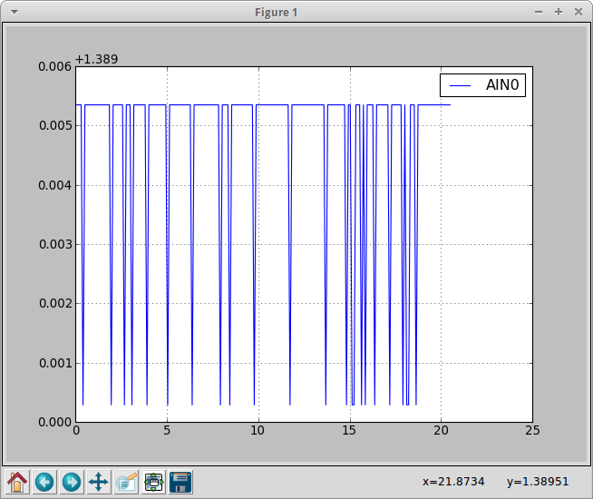
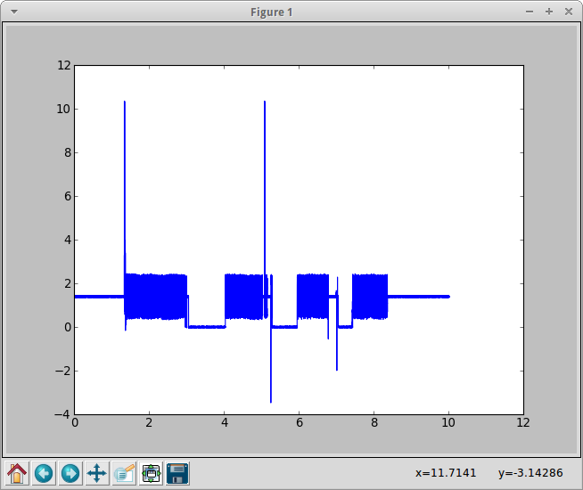

###########
First steps
###########

This section will introduce you shortly in the possibility and methods.
Make sure, duckdaq is importable. I assume, you are using
`IPython <http://ipython.org>`_
as Interpreter.

First, let's create a measurement.

.. code-block:: python
    
    In [1]: import duckDAQ

    In [2]: m = duckDAQ.Measurement.Measurement(TYPE="POLL", ports=["AIN0"], MAX_COUNT=200, DELAY=0.1)

This is a Measurement, which reads PORT0 as analog input every 0.1 seconds. It will
stop automatically after 200 samples. Now we start the measurement.

.. code-block:: python

    In [3]: m.start()

    duckDAQ.Measurement.Measurement 03:58:47 > starting measurement
    duckDAQ.Measurement.Measurement 03:58:47 > mode: POLL
    duckDAQ.Measurement.Measurement 03:58:47 > maxtime: None
    duckDAQ.Measurement.Measurement 03:58:47 > maxcount: 200
    duckDAQ.Measurement.Measurement 03:59:07 > measurement finished

You will notice, that the prompt is at your command just after you call start().
The measurement itself is performed by a seperate thread. If you want the
call return at finished measurment, use start_block().

After the measurment is finished
the aquired data is stored in *m.queue* in tuples. *m.queue* is a *Queue.Queue* object.
The format is:

    (time, porta, portb, ...)

*time* is the time from the first measurement on. *porta*, *portb* and so on is the voltage
measured.

You could read the queue directly, but there are convenient methods for that.
They all start with *"data_"*.  Note, that all *"data_"*
methods empty the queue. So if you want to use the result further, you have to store it
somewhere maybe with *data_ndarray()* or *data_dataframe()*. There are also methods
for csv export and import and *data_qtiplot()*, which starts an
`QtiPlot <http://http://soft.proindependent.com/qtiplot.html>`_
instance for serious data analysis.

For now, let's just plot the result.

.. code-block:: python

    In [4]: m.data_plot()

As expected: A lot of line noise.

Let's create a highspeed measurement, which shows, how noisy the HV-inputs really are.
I therefore make high/low voltages, using GND, VS, AIN0 and a paperclip.
To get high sample rates, we use stream mode this time and want to last it 10 seconds at
a rate of 10000 samples/s

.. code-block:: python

    In [5]: m = duckDAQ.Measurement.Measurement(TYPE="STREAM", ports=["AIN0"], MAX_TIME=10, SCAN_FREQUENCY=20000)

    In [6]: m.start()

    duckDAQ.Measurement.Measurement 04:21:37 > starting measurement
    duckDAQ.Measurement.Measurement 04:21:37 > mode: STREAM
    duckDAQ.Measurement.Measurement 04:21:37 > maxtime: 10
    duckDAQ.Measurement.Measurement 04:21:37 > maxcount: None
    duckDAQ.Measurement.Measurement 04:21:47 > measurement finished

You have to specify a sample rate well higher than 2500. This is caused by
the LabJackPython (or eventually the driver, or the LabJack) itself.

This time, we save the data temporarely as ndarray.

.. code-block:: python

    In [4]: a = m.data_ndarray()

    In [5]: a
    Out[5]: 
    array([[  0.00000000e+00,   1.40446947e+00],
           [  5.00000000e-05,   1.38422710e+00],
           [  1.00000000e-04,   1.38422710e+00],
           ..., 
           [  1.00198500e+01,   1.40446947e+00],
           [  1.00199000e+01,   1.39434828e+00],
           [  1.00199500e+01,   1.36398474e+00]])

    In [6]: len(a)
    Out[6]: 200400

We see, it are a bit more values as expected. This is because the LabJack delivers
the data in chunks. Thats one reason, why stream mode is not optimal for live analysis.
The plot looks like this, now:

.. code-block:: python

    In [7]: import matplotlib.pyplot as plt

    In [8]: at = a.transpose()

    In [28]: plt.plot(at[0], at[1])
    Out[28]: [<matplotlib.lines.Line2D at 0x1aa49d50>]

    In [29]: plt.show()

These are only two examples, what you can do in an IPython-console. See
the API-refecence of duckduck.Measurement for all class-methods.
