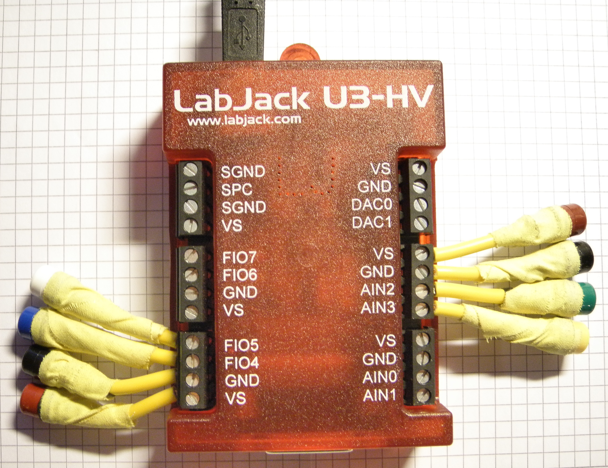
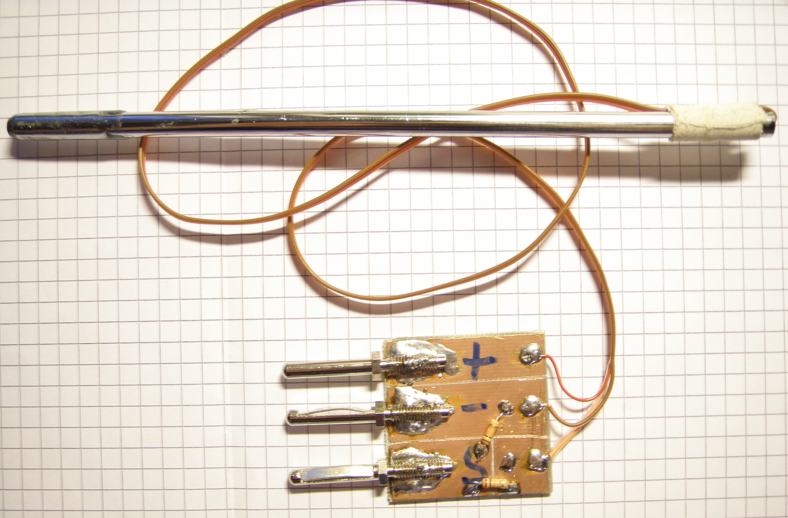

.. duckDAQ documentation master file, created by
   sphinx-quickstart on Wed May 15 18:46:49 2013.
   You can adapt this file completely to your liking, but it should at least
   contain the root `toctree` directive.

Welcome to duckDAQ's documentation!
===================================

Contents
--------

.. toctree::
    :maxdepth: 2

    install
    tutorial
    api
    TODO

Indices and tables
------------------

* :ref:`genindex`
* :ref:`modindex`
* :ref:`search`

What duckDAQ is
===============

DuckDAQ is an educational software for data acquisition and analyis. The focus lies
on *live* analyis both in class and in lab.

The program aims to provide similar functionality as
common didactic software like
`Leybold CassyLab <http://www.ld-didactic.de/index.php?id=cassy-s>`_ or
`PHYWE measure <http://www.phywe.de/1875/Schule/measure-die-PHYWE-Mess-Software.htm>`_.
The difference is, that experiments are not clicked together like in
the programs mentioned above, because
this is unflexible, slow, inconvenient and provides no mechanism, to extend the software.

Just like in LabVIEW, data flow is the foundation of duckDAQ.
Data comes from sources (called *Measurements*) is modified sample by sample
with a cascade of *Filters* (which are e.g. converting voltage to temperature)
and then the result goes to a *Display*, for example a plotter or a seven-segment display.

Unlike in LabVIEW, you don't program grahically, but in form of a python script.
The following example shows an experiment, where a translation sensor is read.

.. code-block:: python

    import duckdaq as dd

    m = dd.Measurement(["AIN0"],
                    TYPE="POLL",
                    MAX_TIME=20)
    m.start()

    sw = dd.Device.SpikeWheel(m)
    sw.start()

    plt = dd.Display.Plotter(sw.outm, startLive=True)
    dd.gui_block()

The first two lines (after the import) create an analog *Measurement* and start it.
After this, the next two lines open a special Filter, called *Device*, to convert
the data from the ADC into the distance, the translation sensor has traveled.
The last two lines display a function plotter, which shows the results in
form of a graph.

You may note, that the the Filter *sw* gets the Measurement *m* and provides *sw.outm*,
which is passed to the Display *plt*. This is the data flow.

What duckDAQ is not
===================

DuckDAQ is no heavy-duty DAQ or analysis tools. It is not optimized for speed and
provides no badass data analysis. A high range of DAQ devices will not supported.
Serious DAQ hardware with many-many samples per second will not be supported.

Nevertheless, duckDAQ is open source and can be modified to your needs.
Pandas, PyTables, NumPy and all other analysis tools are at your command.

What you need
=============

At first, you need a computer which has Linux (better, platform of development) or
`Windows <http://www.fsf.org/windows8>`_
installed.
`OSX <http://www.stallman.org/apple.html>`_
should work without problems, but is untested.

The next thing you need, is an analog digital converter, of course. At 
the moment, the only supported device is a
`LabJack U3-HV <http://labjack.com/u3>`_
because I own this one.
`LabJack <http://labjack.com>`_
is a very nice company, where the drivers and APIs are released
open source. They have a support forum, where you'll get an answer within hours,
if you have a problem.

A U3-HV costs about 130 Euros, which is dirt cheap for a device this capable.
There are
`boxes with better performance data from National Instruments <http://www.ni.com/mydaq>`_,
but
these aim for customer retention in schools
and universities. It's not a fair price.

Support for few other devices is planned vaguely. Arudino/Firmata would sure be
a nice-to-have, because this could be used as an ultra-cheap adc in lab.

If you want to volunteer for implementing arduino support,
please contact me!

In Germany, the
standard connector for school and lab equipment are banana jacks, so I equipped my
LabJack with some of those. Twenty minutes of work. Totally worth it.

Sensors can then be connected with banana plugs. For example my LM335 based
thermometer looks like this:

